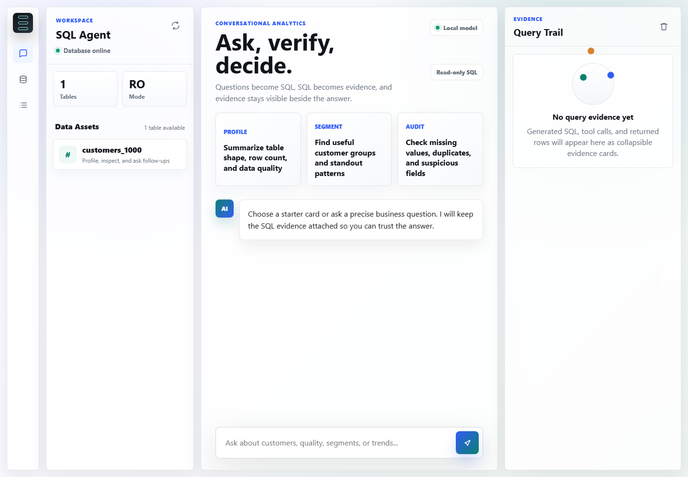

# SQL Agent

A local, read-only analytical SQL agent for chatting with Microsoft SQL Server.
It combines a FastAPI backend, a browser-based analytics workspace, LangChain /
LangGraph, Ollama, SQLAlchemy, and a shared SQL safety layer.



## What It Does

- Lets users ask natural-language questions about a SQL Server database.
- Converts questions into read-only SQL through a local LLM agent.
- Shows database tables as data assets in the UI.
- Keeps SQL/tool evidence visible beside the answer.
- Blocks dangerous SQL with a shared validator before execution.
- Supports CLI and browser usage.
- Includes production-oriented controls such as health checks, request limits,
  trusted hosts, CSP headers, sanitized errors, and optional API access keys.

## Architecture

```text
Browser workspace
    |
    v
FastAPI backend
    |
    v
SQL Agent / LangChain / Ollama
    |
    v
Read-only SQL tools
    |
    v
Microsoft SQL Server
```

The browser never connects directly to SQL Server. The backend owns database
access, SQL validation, agent execution, health checks, and API protection.

## Project Structure

```text
.
|-- src/sql_agent/
|   |-- web/             # Static browser workspace
|   |-- tools/           # Database tools exposed to the agent
|   |-- nodes/           # Older graph workflow node experiments
|   |-- agent.py         # Shared agent setup
|   |-- cli.py           # Interactive CLI app
|   |-- database.py      # SQLAlchemy engine
|   |-- safety.py        # Read-only SQL validation
|   |-- settings.py      # Environment-based app config
|   `-- web.py           # FastAPI app
|-- docs/
|   `-- screenshots/     # README screenshots
|-- tests/               # Automated tests
|-- main.py              # CLI convenience entry point
|-- pyproject.toml       # Package metadata
|-- requirements.txt     # Runtime dependencies
`-- .env.example         # Deployment configuration template
```

## Setup

Create and activate a virtual environment, then install the project:

```powershell
python -m pip install -e .
```

Make sure these services are running:

- Ollama
- SQL Server
- ODBC Driver 17 for SQL Server

If you are using SQL Server Express locally, your connection URL may look like:

```powershell
$env:SQL_AGENT_DATABASE_URL = "mssql+pyodbc://localhost\SQLEXPRESS/Customers1000db?driver=ODBC+Driver+17+for+SQL+Server&trusted_connection=yes"
```

## Run The Web App

```powershell
python -m uvicorn sql_agent.web:app --host 127.0.0.1 --port 8000
```

Open:

```text
http://127.0.0.1:8000
```

Health checks:

```text
http://127.0.0.1:8000/health/live
http://127.0.0.1:8000/health/ready
```

## Run The CLI

```powershell
python main.py
```

Or, if your Python scripts folder is on PATH:

```powershell
sql-agent
```

## Configuration

Use `.env.example` as the template for deployment settings.

Common environment variables:

```text
SQL_AGENT_DATABASE_URL          SQLAlchemy SQL Server connection URL
SQL_AGENT_OLLAMA_MODEL          Ollama model name, default qwen3:8b
SQL_AGENT_HOST                  Bind host, default 127.0.0.1
SQL_AGENT_PORT                  Bind port, default 8000
SQL_AGENT_RELOAD                Enable reload only for local development
SQL_AGENT_ALLOWED_HOSTS         Comma-separated allowed Host headers
SQL_AGENT_ALLOWED_ORIGINS       Comma-separated CORS origins, if needed
SQL_AGENT_AGENT_TIMEOUT_SECONDS Max time for one agent request
SQL_AGENT_MAX_QUESTION_CHARS    Max user question length
SQL_AGENT_MAX_REQUEST_BYTES     Max HTTP request body size
SQL_AGENT_ACCESS_KEY            Optional browser API access key
```

If `SQL_AGENT_ACCESS_KEY` is set, browser API calls must include the matching
key. The UI will prompt users for it.

## Security Notes

- Use a SQL Server login with read-only permissions.
- Treat database permissions as the primary safety boundary.
- Keep the SQL validator as defense in depth, not the only protection.
- Set `SQL_AGENT_ACCESS_KEY` for shared environments.
- Put the app behind a reverse proxy for TLS and public routing.
- Set `SQL_AGENT_ALLOWED_HOSTS` to real production domains.
- Keep `SQL_AGENT_RELOAD=false` outside development.
- Do not expose this app publicly without authentication.

## Verification

Run tests with the same Python interpreter used for the app:

```powershell
python -m pytest -q
```

Current expected result:

```text
7 passed
```

## Screenshot Refresh

To regenerate the README screenshot while the app is running:

```powershell
New-Item -ItemType Directory -Force docs\screenshots | Out-Null
& "C:\Program Files\Google\Chrome\Application\chrome.exe" --headless=new --disable-gpu --hide-scrollbars --window-size=1440,1000 --screenshot="A:\Anas Data\Anas Projects\SQL Agent\docs\screenshots\sql-agent-workspace.png" http://127.0.0.1:8000/
```
